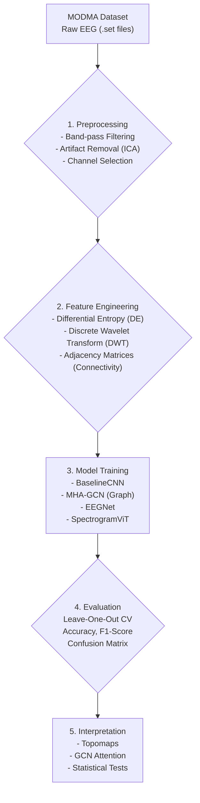
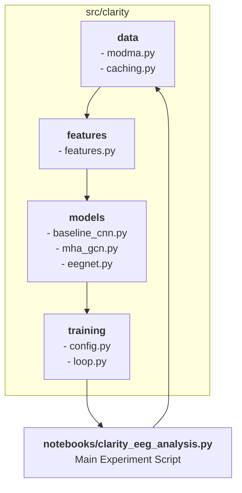

# Clarity-AI: A Research Sandbox for EEG-based Depression Analysis

*An open-source initiative to build a "Psychiatry Digital Twin" by decoding brain signals to better understand and classify Major Depressive Disorder (MDD).*

<p align="center">
  
  
  
  
</p>

---

This repository is a comprehensive, high-quality sandbox for applying state-of-the-art deep learning techniques to EEG data for mental health research. It provides a full pipeline—from data preprocessing to model training and evaluation—using the publicly available **MODMA dataset**. Our goal is to create a transparent, reproducible, and extensible platform for researchers, clinicians, and data scientists to accelerate the discovery of objective biomarkers for depression.

## High-Level Workflow

The repository is designed around a modular pipeline that takes raw EEG data and transforms it into actionable insights.



---

## The Scientific Foundation

### Why EEG for Depression?
Major Depressive Disorder (MDD) is traditionally diagnosed through subjective clinical interviews. Electroencephalography (EEG) offers a non-invasive, objective window into brain function. By analyzing patterns of neural oscillations and connectivity, we can identify potential electrophysiological biomarkers of depression, paving the way for more precise diagnostics and personalized treatments.

### The MODMA Dataset
This project uses the **Multi-Modal Open Dataset for Mental-Disorder Analysis (MODMA)**. It contains resting-state EEG data from 53 participants (24 MDD patients and 29 healthy controls), making it an invaluable resource for cross-subject classification tasks.

### Key Biomarkers & Features
Our models don't just see raw signals; they are trained on scientifically-grounded features known to be relevant in depression research:
-   **Differential Entropy (DE):** A measure of signal complexity in different frequency bands (Delta, Theta, Alpha, Beta, Gamma), which has been linked to emotional states.
-   **Discrete Wavelet Transform (DWT):** Captures transient, non-stationary features in the EEG signal across multiple time scales.
-   **Graph-based Connectivity:** By computing adjacency matrices (e.g., via correlation), we model the brain as a graph, allowing Graph Convolutional Networks (GCNs) to learn from the topological relationships between brain regions.

---

## Technical Architecture

The repository is structured as a modular Python package (`src/clarity`) to ensure code is clean, reusable, and easy to maintain.

### Tech Stack
-   **Data Handling & Preprocessing:** `MNE-Python`, `NumPy`, `SciPy`
-   **Deep Learning:** `PyTorch`, `PyTorch Geometric` (for GCNs)
-   **Modeling & Evaluation:** `scikit-learn`, `timm` (for Vision Transformers)
-   **Visualization:** `Matplotlib`, `Seaborn`
-   **Environment:** `JupyterLab`, `Python 3.10+`

### Code Structure
The `src/clarity` package separates concerns into logical modules, making the codebase easy to navigate and extend.



---

## Key Features
-   **Rigorous Evaluation:** Implements **Leave-One-Out Cross-Validation (LOOCV)** for robust, unbiased performance assessment on the entire dataset.
-   **Multiple Model Architectures:**
    -   `BaselineCNN`: A simple 1D CNN for a solid starting point.
    -   `MHA_GCN`: A Multi-Head Attention Graph Convolutional Network that learns from brain connectivity.
    -   `EEGNet`: A state-of-the-art compact CNN designed specifically for EEG signals.
-   **Reproducible Research:** Enforces reproducibility with fixed random seeds and deterministic CUDA operations.
-   **Efficient Workflow:** Includes a caching mechanism to save preprocessed data, dramatically speeding up repeated experiments.
-   **Extensible & Modular:** Designed to be easily extended with new models, features, or even data modalities.
-   **Interpretability Hooks:** Provides methods for visualizing results (confusion matrices) and model decisions (topomaps, GCN attention weights).

---

## Getting Started

### 1. Create a Python Environment
We strongly recommend using a virtual environment.
```bash
python3 -m venv .venv
source .venv/bin/activate
# On Windows, use: .venv\Scripts\activate
```

### 2. Install Dependencies
For a fully reproducible environment with pinned versions, use `requirements.lock.txt`.
```bash
# For a stable, reproducible environment
pip install -r requirements.lock.txt

# Or for a flexible development environment
pip install -r requirements.txt
```
*Note: If you have trouble with `torch-geometric`, please consult their official installation instructions to install dependencies for your specific OS/CUDA version.*

### 3. Download the MODMA Dataset
You must request access to the MODMA dataset directly from the researchers.
-   **Register and request access** at the [official dataset portal](https://modma.lzu.edu.cn/data/index/).
-   Once you receive the download link, place and unpack the archive in the `data/` directory.
-   The expected file structure is `data/MODMA/EEG_128channel_resting/sub01/rest.set`.

### 4. Launch the Analysis
With your environment activated, you can run the main analysis script as a notebook.
```bash
jupyter lab
```
Navigate to `notebooks/clarity_eeg_analysis.py` to open and run the analysis. We recommend using VS Code's Jupyter extension for the best experience.

---

## Roadmap & Future Directions
This sandbox is an active project. Our roadmap is focused on pushing the boundaries of scientific rigor and technical capability.

-   **Advanced Preprocessing:** Integrate more sophisticated artifact removal techniques and ensure our pipeline is fully configurable.
-   **Multi-Class Severity Prediction:** Move beyond binary classification (Depressed vs. Control) to predict depression severity levels based on PHQ-9 scores, a more clinically relevant task.
-   **Expanded Model Zoo:**
    -   Implement **Vision Transformer (ViT)** models on EEG spectrograms.
    -   Add **RNN/LSTM-based** models to better capture temporal dynamics.
-   **Multimodal Fusion:** Incorporate other data modalities from the MODMA dataset (e.g., audio/speech) to build more holistic "digital twin" models.
-   **Fairness & Bias Audits:** Introduce tools to analyze model performance across different demographic subgroups, ensuring our models are equitable and unbiased.
-   **Explainable AI (XAI):** Enhance interpretability methods to better understand *why* our models make certain predictions, bridging the gap between deep learning and clinical insight.

---


## License and Terms of Use

This project is intended for **academic and non-commercial research purposes only**.

The [MODMA dataset](https://modma.lzu.edu.cn/data/index/) used in this research is subject to its own End User License Agreement (EULA). Users of this codebase are responsible for obtaining the dataset themselves and adhering to all of its terms, which strictly prohibit commercial use.

---

## Core Scientific References
The methodologies implemented here are grounded in the following key research papers.

1.  **MODMA Dataset:**
    Cai, H., Yuan, Z., Gao, Y., et al. A multi-modal open dataset for mental-disorder analysis. *Sci Data* **9**, 178 (2022). [https://doi.org/10.1038/s41597-022-01211-x](https://doi.org/10.1038/s41597-022-01211-x)

2.  **Depression Level Classification & Sample Confidence:**
    Zhang, Z., Xu, C., Zhao, L., Hou, H., & Meng, Q. (2025). Cross-Subject Depression Level Classification Using EEG Signals with a Sample Confidence Method. *arXiv preprint arXiv:2503.13475*.

3.  **Graph-based EEG Analysis:**
    Liu, W., Jia, K., & Wang, Z. (2024). Graph-based EEG approach for depression prediction: integrating time-frequency complexity and spatial topology. *Frontiers in Neuroscience*, *18*, 1367212. [https://doi.org/10.3389/fnins.2024.1367212](https://doi.org/10.3389/fnins.2024.1367212)

4.  **Multimodal Detection (GCN and Transformer):**
    Jia, X., Chen, J., Liu, K., Wang, Q., & He, J. (2025). Multimodal depression detection based on an attention graph convolution and transformer. *Mathematical Biosciences and Engineering*, *22*(3), 652-676. [https://doi.org/10.3934/mbe.2025024](https://doi.org/10.3934/mbe.2025024)

---

## How to Contribute
We welcome contributions! Please feel free to open an issue or submit a pull request. 
